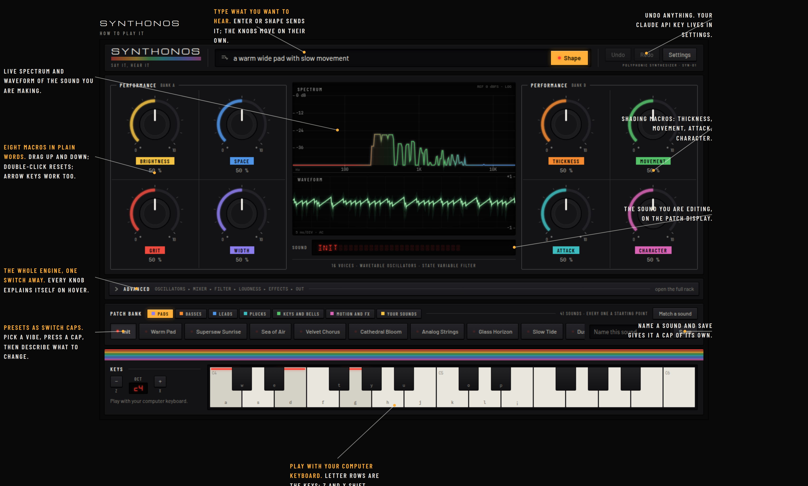
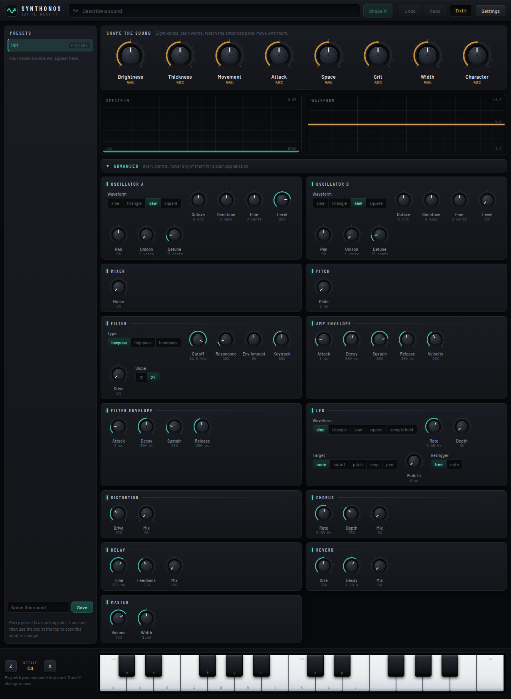

# Synthonos

A natural language controlled virtual analog synthesizer that runs locally.
Type "make it darker and wider" and watch the knobs move. Built for people
who have never opened a DAW.



<details>
<summary><b>The full engine behind the Advanced toggle</b></summary>



</details>

## Try it in two minutes

```
npm install
npm run dev        # open http://localhost:1420
```

Press any key (browser audio needs one gesture), then play `A S D F G H J K L ;`
on your computer keyboard. `Z` and `X` shift the octave. Drag the eight big
knobs; double-click resets one; `Ctrl+Z` undoes anything.

To talk to it: open **Settings** (top right), paste an Anthropic API key
(stored on your machine, sent only to the Anthropic API), then type into the
describe bar: *"warm wide pad"*, *"more bite"*, *"same but plucky"*.

## What this is

- A Sylenth-class 16-voice subtractive synth: bandlimited wavetable
  oscillators (worst-case aliasing -119 dBFS), an 8-voice-unison stack per
  oscillator, a TPT state variable filter, exponential envelopes, and an
  engine written in dependency-free TypeScript running in an AudioWorklet,
  mechanically portable to Rust for a future VST3/CLAP build.
- Natural language patch editing via schema-constrained JSON, never free
  text. Out-of-range edits are rejected, never clamped; every edit is
  animated and undoable.
- Audio-to-patch matching (`python/`): give it a WAV and a parameter search
  (differential evolution over a multi-resolution STFT loss, candidates
  rendered through the real engine) finds the closest sound our engine can
  make. Match, not Clone: it approximates, it does not recover presets.

Read SYNTH_BUILD_PLAN.md for the full plan and reasoning, CLAUDE.md for the
hard rules, and docs/TESTING.md for how the audio is kept honest (spectral
test harness, golden renders, real-time safety scans; the harness caught
real bugs before any synthesis code existed).

## Status

| Milestone | State |
| --- | --- |
| M0 foundation: schema, codegen, spectral harness, CI | done |
| M1/M2 engine: 16 voices, aliasing-free oscillators, click-free stealing | done |
| M4 interface: three layers, scopes, presets, undo | done |
| M5 natural language control | done |
| M6 audio match: parameter search service + in-app match panel | done |
| Effects chain + expanded schema (53 params: drive, glide, chorus, delay, reverb...) | done |
| 40 factory presets, organized by vibe, golden-rendered | done |
| M7 packaging: Tauri desktop build and onboarding | next (needs a desktop machine to compile) |

## Commands

```
npm test              # full suite incl. harness self-tests and golden renders
npm run typecheck
npm run codegen       # regenerate everything from params.schema.json
npm run codegen:check # what CI runs; fails on drift
npm run render        # render the default preset to test/output/*.wav
python3 -m pytest python/tests   # audio matcher (needs pip install -r python/requirements.txt)
```

## Layout

```
params.schema.json    single source of truth for every parameter
scripts/codegen.ts    emits types, presets, UI manifest, LLM schema, bounds
src/dsp/              the engine; imports nothing external, portable to Rust
src/audio/            AudioWorklet shell and bridge
src/nl/               natural language control (Claude API, BYO key)
src/ui/               React interface; advanced panel is 100% schema-generated
src/generated/        codegen output; never edit by hand
python/synthmatch/    audio-to-patch matching service (FastAPI, localhost)
test/harness/         offline renderer, hand-written FFT, spectral assertions
test/golden/          reference renders; changes must be deliberate
```
